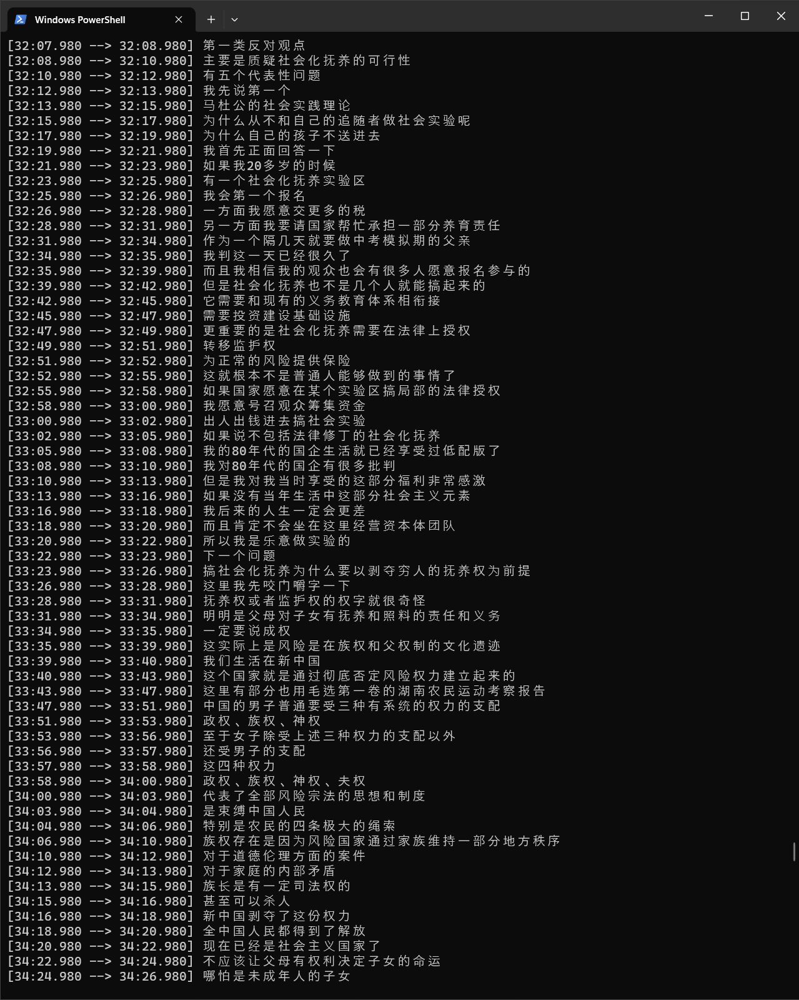

# Web_Video2Text
## Now supports videos on both Youtube and BiliBili 
Input a video web page url, transcribe the video without downloading it.

* No longer using *Speechmatics* to transcribe audio files from online urls, but using *Whisper* from OpenAI as a more convinient way of transcribing.   https://github.com/openai/whisper

* Add serveral easy to access command line arguments. 

* For Youtube videos, *yt-dlp* is used to fetch video urls. More on https://github.com/yt-dlp/yt-dlp. 

* For b站视频, Url parsing code is from https://www.bilibili.com/video/BV1LX4y1u7VA/?spm_id_from=333.880.my_history.page.click. and https://cloud.tencent.com/developer/article/1768680.
It only supports parsing videos from *BiliBili*. Some amendments are made to the original code since BiliBili changed their web code. 

### Preparation
根据 https://github.com/openai/whisper 的指引下载 *Whisper*:
```
pip install -U openai-whisper
```
<br>
__For Youtube:__

Get *yt-dlp* from https://github.com/yt-dlp/yt-dlp. Guides for installation could be found on the same page, no more operation needed.
This is only for fetching Youtube video urls. 
<br>
<br>
**For BiliBili:**

在视频网页，查看网页代码F12 -> Network -> Name 并复制'user_agent'到'headers':
```python
headers = {
    'user-agent': 'copy your user-agent here'}
```
以上步骤只需要进行一次。

### Arguments

**--model:** Choose from the models provided by *Whisper*, tiny/base/small/medium/large. **Notice this downloads any model that is on your local device**, and medium/large models are **huge**. 

**--language:** Choose language to transcribe, by defualt it will be set to 'NULL', which auto-detects language. Check https://github.com/openai/whisper for supported languages.

**--save:** Choose whether to save the transcription as a file. It will be saved to the same directory where the code is located. 

**--stamp:** Choose whether to include time stamps in transcribed files.


完成后直接运行并输入视频网址:
```
python video2text_public.py
video_url: 'your url'
```

The transcription will appear in terminal.

